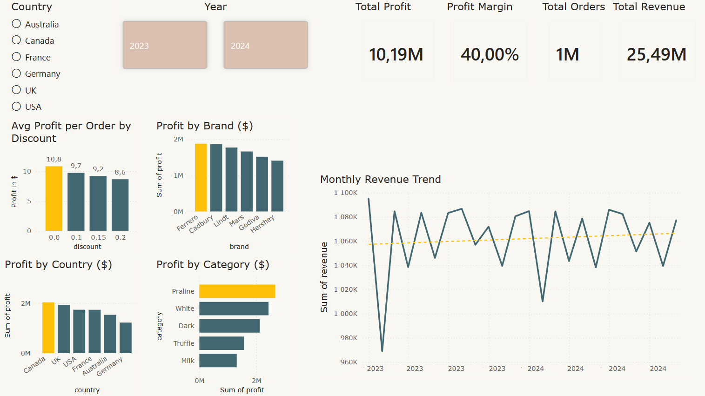
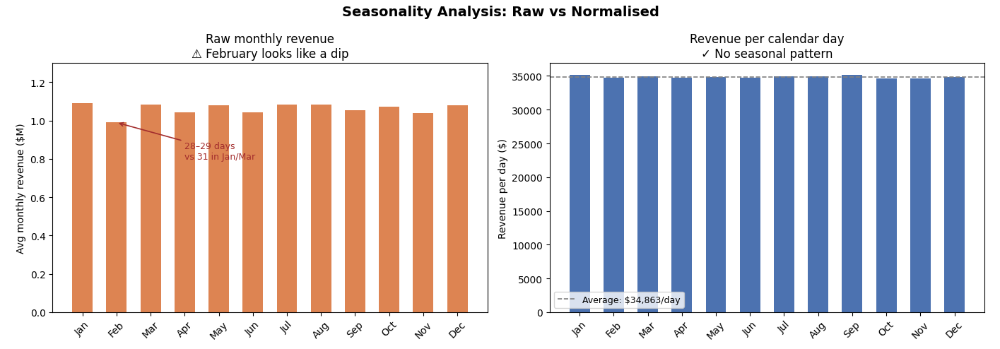

# Chocolate Store Chain: Sales & Marketing Performance Analysis

## Project Overview
This project provides a comprehensive data-driven audit of operational performance and marketing effectiveness for an international chain of chocolate shops. The primary objective is to identify key profit-driving regions, evaluate the ROI of discount strategies, and assess the actual impact of the customer loyalty program on financial outcomes.

## Dashboard

## Key Performance Indicators (KPIs)
* **Total Revenue:** $25.49M
* **Total Profit:** $10.19M
* **Profit Margin:** 40.00%
* **Total Orders:** 1M+

## Technology Stack
* **Language:** Python 3
* **Data Manipulation:** Pandas
* **Data Visualization:** Matplotlib, Ticker (for professional chart formatting)
* **Reporting:** PDF Dashboard Generation

## Data Architecture
The analysis is built on a relational database structure consisting of 5 datasets (CSV):
1. `sales.csv`: Core transaction logs (order dates, quantities, unit pricing, discounts applied, revenue, cost, and profit).
2. `products.csv`: Product catalog detailing brands (Ferrero, Lindt, etc.), categories (Praline, Dark, White, etc.), cocoa percentages, and weights.
3. `stores.csv`: Point-of-sale information including geographic location (country, city) and store type (Retail, Mall, Airport, Online).
4. `customers.csv`: Client demographics (age, gender) and loyalty program membership status.
5. `calendar.csv`: Date grid used for time-series and seasonality extraction.

## Core Insights & Business Recommendations

### 1. Geographic Performance
* **Insight:** Canada and the USA are the undisputed market leaders, generating $2.14M and $2.02M in profit, respectively. Conversely, Germany is the weakest market and relies disproportionately on Airport store traffic.
* **Recommendation:** Consolidate retail presence in North America. For Germany, halt expansion of standard retail/mall stores and pivot the strategy entirely toward travel retail (airports) or online sales.

### 2. Brand & Category Dynamics
* **Insight:** All brands have nearly identical average unit prices (~$9.00). However, Ferrero dominates total profit ($1.87M) purely through massive transaction volume (183,603 orders). By category, Praline is the top performer ($2.82M), while Milk chocolate severely underperforms ($1.27M).
* **Recommendation:** Optimize inventory space to prioritize Praline and Ferrero products. Conduct a pricing or quality review of the Milk chocolate line to understand its low market penetration.

### 3. Discount Strategy & Profitability
* **Insight:** Current discounting practices are aggressively eroding margins. Applying a 20% discount drops the average profit per order from $10.81 down to $8.64.
* **Recommendation:** Implement a strict 10% cap on standard discounts. Deeper discounts should be reserved exclusively for inventory clearance, not routine promotions.

### 4. Loyalty Program Efficacy
* **Insight:** The current loyalty program has zero measurable financial impact. Both loyalty members and non-members generate the exact same profit per order (~$10.20).
* **Recommendation:** Immediately restructure the loyalty program. Shift away from flat discounts and move towards volume-based incentives or exclusive product access to increase the average order value (AOV).

### 5. Time-Series & Seasonality
* **Insight:** There are no significant seasonal spikes. Daily revenue remains completely static at ~$34,800 across all months in both 2023 and 2024. The business is stable, but stagnant.
* **Recommendation:** Introduce aggressive seasonal marketing campaigns (e.g., Valentine's Day, Winter Holidays) to manufacture demand peaks and drive YoY growth.

## Key Visualizations

## Repository Contents
* `chocolate.ipynb`: The main Jupyter Notebook containing data cleaning, Exploratory Data Analysis (EDA), and financial calculations.
* `Choco_dashboard.pdf`: A static executive dashboard visualizing the final metrics and trends.
* `Data Files/`: The 5 `.csv` files required to execute the analysis.

## How to Run
1. Clone the repository to your local machine.
2. Ensure you have Python 3 and the required libraries (`pandas`, `matplotlib`) installed.
3. Keep the `.csv` data files in the same directory as the notebook.
4. Run `chocolate.ipynb` cell-by-cell to reproduce the analysis and charts.
